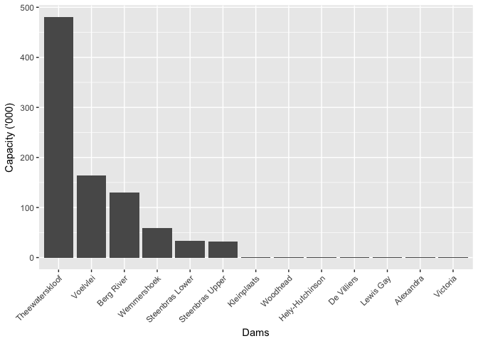
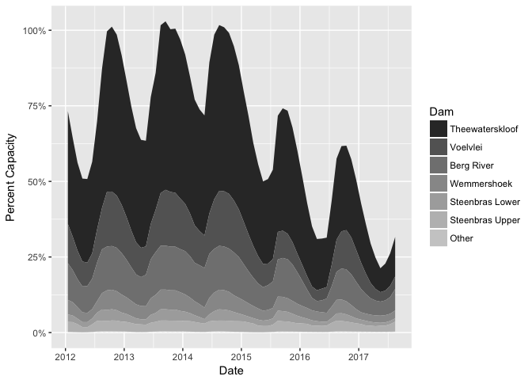
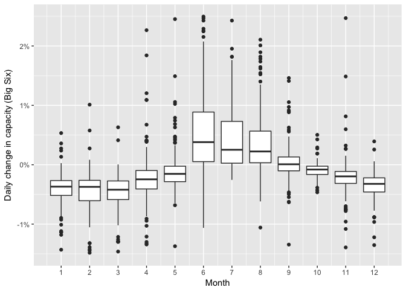
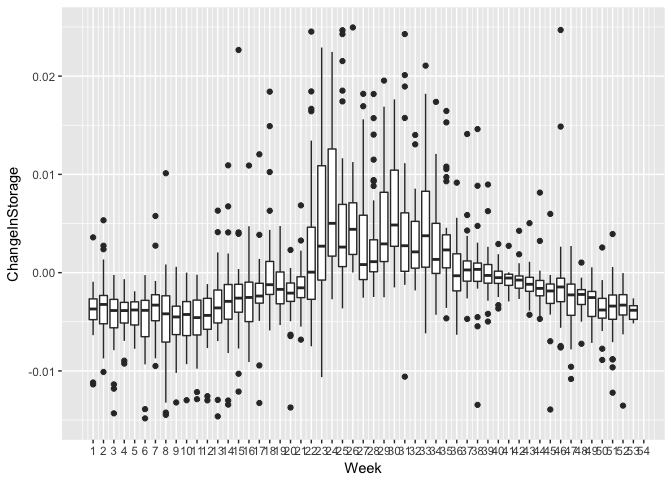
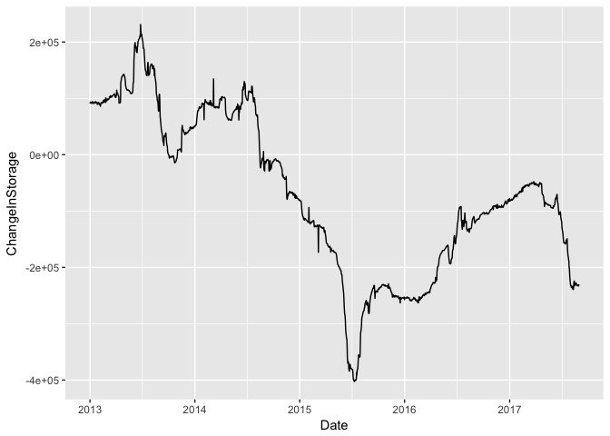
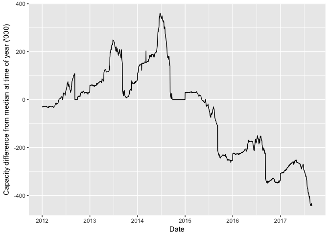

Analysis of Western Cape Dam Levels
===================================

Below are some calculations and visualisations of the water levels of the Dams in the Western Cape (WC) province of South Africa.

The data is gathered from the City of Cape Town data portal and cleaned in a separate script. I have uploaded the cleaned version of the data to github where it can be extracted.

Load Dependencies
-----------------

``` r
library(tidyverse)
library(lubridate)
library(knitr)
library(forcats)
```

Data Import
-----------

``` r
StorageLong<-read.csv("Data/Clean_WC_Dam_Levels.csv",stringsAsFactors = F) %>% 
  mutate(Date=ymd(Date)) 

StorageLong %>% 
  head(10) %>% 
  kable()
```

|    X| Dam       | Date       |  Storage|  Capacity|  PercentDamCapacity|  PercentTotalCapacity|
|----:|:----------|:-----------|--------:|---------:|-------------------:|---------------------:|
|    1| Alexandra | 2012-01-01 |     99.9|       134|           0.7455224|             0.0001107|
|    2| Alexandra | 2012-01-02 |     99.2|       134|           0.7402985|             0.0001100|
|    3| Alexandra | 2012-01-03 |     98.7|       134|           0.7365672|             0.0001094|
|    4| Alexandra | 2012-01-04 |     99.2|       134|           0.7402985|             0.0001100|
|    5| Alexandra | 2012-01-05 |     98.9|       134|           0.7380597|             0.0001096|
|    6| Alexandra | 2012-01-06 |     98.5|       134|           0.7350746|             0.0001092|
|    7| Alexandra | 2012-01-07 |     97.7|       134|           0.7291045|             0.0001083|
|    8| Alexandra | 2012-01-08 |     97.3|       134|           0.7261194|             0.0001079|
|    9| Alexandra | 2012-01-09 |     96.8|       134|           0.7223881|             0.0001073|
|   10| Alexandra | 2012-01-10 |     95.8|       134|           0.7149254|             0.0001062|

What are the largest dams and their capacities?
-----------------------------------------------

``` r
StorageLong %>% 
  select(Dam,Capacity) %>% 
  distinct() %>% 
  arrange(desc(Capacity)) %>% 
  ggplot() +
  geom_col(aes(x=fct_rev(fct_reorder(Dam,Capacity)),y=Capacity)) +
  theme(axis.text.x = element_text(angle=45,vjust = 1,hjust = 1)) +
  xlab("Dams") +
  ylab("Capacity ('000)") +
  scale_y_continuous(labels = function(x){x/1000})
```



You can see from the chart that the majority of the capacity is housed in 6 dams. These are generally referred to as the 'Big Six'

``` r
BigSixCapacities<-StorageLong %>% 
  select(Dam,Capacity) %>% 
  distinct() %>% 
  arrange(desc(Capacity)) %>% 
  mutate(Dam=fct_lump(fct_rev(fct_reorder(Dam,Capacity)),6,ties.method = "first")) %>% 
  group_by(Dam) %>% 
  summarise(Capacity=sum(Capacity,na.rm=T))

write.csv(BigSixCapacities,file = "Data/BigSixCapacities.csv")

BigSixCapacities %>% 
  kable()
```

| Dam             |  Capacity|
|:----------------|---------:|
| Theewaterskloof |    480188|
| Voelvlei        |    164095|
| Berg River      |    130010|
| Wemmershoek     |     58644|
| Steenbras Lower |     33517|
| Steenbras Upper |     31767|
| Other           |      3853|

Releveling Factors
------------------

Some of the analysis is made simpler by lumping the smaller dam levels together into a single factor.

``` r
StorageLong %>% 
  select(Dam,Capacity) %>% 
  distinct() %>% 
  arrange(desc(Capacity)) %>% 
  mutate(Dam_Other=fct_lump(fct_reorder(Dam,Capacity,.desc = T),6,ties.method = "first")) %>% 
  kable()
```

| Dam             |  Capacity| Dam\_Other      |
|:----------------|---------:|:----------------|
| Theewaterskloof |    480188| Theewaterskloof |
| Voelvlei        |    164095| Voelvlei        |
| Berg River      |    130010| Berg River      |
| Wemmershoek     |     58644| Wemmershoek     |
| Steenbras Lower |     33517| Steenbras Lower |
| Steenbras Upper |     31767| Steenbras Upper |
| Kleinplaats     |      1301| Other           |
| Woodhead        |       955| Other           |
| Hely-Hutchinson |       925| Other           |
| De Villiers     |       242| Other           |
| Lewis Gay       |       168| Other           |
| Alexandra       |       134| Other           |
| Victoria        |       128| Other           |

Showing seasonal changes
------------------------

``` r
StorageLong %>% 
  mutate(Dam_Other=fct_lump(fct_reorder(Dam,Capacity,.desc = T),6,ties.method = "first")) %>% 
  mutate(Year=year(Date),Month=month(Date)) %>% 
  group_by(Dam,Year,Month,Dam_Other) %>% 
  summarise(PercentTotalCapacity=median(PercentTotalCapacity,na.rm=T),Date=median(Date,na.rm=T)) %>% 
  ungroup() %>% 
  ggplot() +
  geom_area(aes(x=Date,y=PercentTotalCapacity,fill=Dam_Other),position = "stack") +
  scale_fill_grey() +
  scale_y_continuous(labels = scales::percent) +
  scale_x_date(date_breaks =  "1 year",date_labels = "%Y") +
  ylab("Percent Capacity") +
  guides(fill=guide_legend(title = "Dam"))
```



``` r
StorageLong %>% 
  arrange(desc(Capacity)) %>% 
  ungroup() %>% 
  mutate(Dam=fct_lump(fct_rev(fct_reorder(Dam,Capacity)),n=6,ties.method = "first")) %>% 
  filter(Dam!="Other") %>% 
  group_by(Date) %>% 
  summarise(Storage=sum(Storage,na.rm=T)) %>% 
  mutate(ChangeInStorage=(Storage-lag(Storage))/Storage) %>%
  arrange(ChangeInStorage) %>% 
  mutate(Month=month(Date)) %>% 
  ggplot(aes(x=Month,y=ChangeInStorage)) +
  geom_boxplot(aes(group=Month)) +
  scale_x_continuous(breaks = 1:12) +
  scale_y_continuous(limits = c(-0.015,0.025),labels = scales::percent) +
  ylab("Daily change in capacity (Big Six)")
```



``` r
StorageLong %>% 
  arrange(desc(Capacity)) %>% 
  ungroup() %>% 
  mutate(Dam=fct_lump(fct_rev(fct_reorder(Dam,Capacity)),n=6,ties.method = "first")) %>% 
  filter(Dam!="Other") %>% 
  group_by(Date) %>% 
  summarise(Storage=sum(Storage,na.rm=T)) %>% 
  mutate(ChangeInStorage=(Storage-lag(Storage))/Storage) %>%
  arrange(ChangeInStorage) %>% 
  mutate(Week=week(Date)) %>% 
  ggplot(aes(x=Week,y=ChangeInStorage)) +
  geom_boxplot(aes(group=Week)) +
  scale_x_continuous(breaks = 1:54) +
  scale_y_continuous(limits = c(-0.015,0.025))
```



``` r
StorageLong %>% 
  arrange(desc(Capacity)) %>% 
  ungroup() %>% 
  mutate(Dam=fct_lump(fct_rev(fct_reorder(Dam,Capacity)),n=6,ties.method = "first")) %>% 
  filter(Dam!="Other") %>% 
  group_by(Date) %>% 
  summarise(Storage=sum(Storage,na.rm=T)) %>% 
  mutate(ChangeInStorage=(Storage-lag(Storage,n = 365))) %>% 
  filter(!is.na(ChangeInStorage)) %>% 
  filter(Storage!=0) %>% 
  ggplot(aes(x=Date,y=ChangeInStorage))+
  geom_line(na.rm = T)
```



``` r
StorageLong %>% 
  arrange(desc(Capacity)) %>% 
  ungroup() %>% 
  mutate(Dam=fct_lump(fct_rev(fct_reorder(Dam,Capacity)),n=6,ties.method = "first")) %>% 
  filter(Dam!="Other") %>% 
  group_by(Date) %>% 
  summarise(Storage=sum(Storage,na.rm=T)) %>% 
  mutate(DateDayMonth=make_date(1990, month(Date), day(Date))) %>% 
  group_by(DateDayMonth) %>% 
  mutate(AvrStorage=median(Storage,na.rm=T)) %>% 
  mutate(StorageDiff=(Storage-AvrStorage)) %>% 
  filter(!is.na(DateDayMonth)) %>% 
  filter(Storage!=0) %>% 
  #View()
  ggplot(aes(x=Date,y=StorageDiff)) +
  geom_line(na.rm = T) +
  scale_x_date(date_breaks = "1 year",date_labels  = "%Y") +
  scale_y_continuous(labels = function(x){x/1000}) +
  ylab("Capacity difference from median at time of year ('000)") 
```


