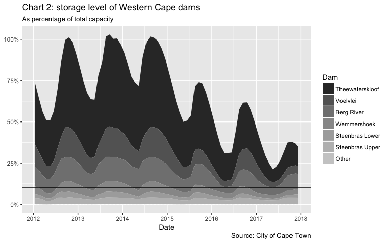
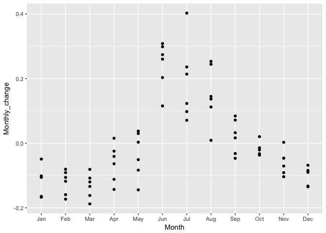

Analysis of Western Cape Dam Levels
===================================

Below are some calculations and visualisations of the water levels of
the Dams in the Western Cape (WC) province of South Africa.

The data is gathered from the City of Cape Town data portal and cleaned
in a separate script. I have uploaded the cleaned version of the data to
github where it can be extracted.

Load Dependencies
-----------------

    library(tidyverse)
    library(lubridate)
    library(knitr)
    library(forcats)

Data Import
-----------

    StorageLong<-read.csv("Data/Clean_WC_Dam_Levels.csv",stringsAsFactors = F) %>% 
      mutate(Date=ymd(Date)) 

    StorageLong %>% 
      head(10) %>% 
      kable()

<table>
<thead>
<tr class="header">
<th align="right">X</th>
<th align="left">Dam</th>
<th align="left">Date</th>
<th align="right">Storage</th>
<th align="right">Capacity</th>
<th align="right">PercentDamCapacity</th>
<th align="right">PercentTotalCapacity</th>
</tr>
</thead>
<tbody>
<tr class="odd">
<td align="right">1</td>
<td align="left">Alexandra</td>
<td align="left">2012-01-01</td>
<td align="right">99.9</td>
<td align="right">134</td>
<td align="right">0.7455224</td>
<td align="right">0.0001107</td>
</tr>
<tr class="even">
<td align="right">2</td>
<td align="left">Alexandra</td>
<td align="left">2012-01-02</td>
<td align="right">99.2</td>
<td align="right">134</td>
<td align="right">0.7402985</td>
<td align="right">0.0001100</td>
</tr>
<tr class="odd">
<td align="right">3</td>
<td align="left">Alexandra</td>
<td align="left">2012-01-03</td>
<td align="right">98.7</td>
<td align="right">134</td>
<td align="right">0.7365672</td>
<td align="right">0.0001094</td>
</tr>
<tr class="even">
<td align="right">4</td>
<td align="left">Alexandra</td>
<td align="left">2012-01-04</td>
<td align="right">99.2</td>
<td align="right">134</td>
<td align="right">0.7402985</td>
<td align="right">0.0001100</td>
</tr>
<tr class="odd">
<td align="right">5</td>
<td align="left">Alexandra</td>
<td align="left">2012-01-05</td>
<td align="right">98.9</td>
<td align="right">134</td>
<td align="right">0.7380597</td>
<td align="right">0.0001096</td>
</tr>
<tr class="even">
<td align="right">6</td>
<td align="left">Alexandra</td>
<td align="left">2012-01-06</td>
<td align="right">98.5</td>
<td align="right">134</td>
<td align="right">0.7350746</td>
<td align="right">0.0001092</td>
</tr>
<tr class="odd">
<td align="right">7</td>
<td align="left">Alexandra</td>
<td align="left">2012-01-07</td>
<td align="right">97.7</td>
<td align="right">134</td>
<td align="right">0.7291045</td>
<td align="right">0.0001083</td>
</tr>
<tr class="even">
<td align="right">8</td>
<td align="left">Alexandra</td>
<td align="left">2012-01-08</td>
<td align="right">97.3</td>
<td align="right">134</td>
<td align="right">0.7261194</td>
<td align="right">0.0001079</td>
</tr>
<tr class="odd">
<td align="right">9</td>
<td align="left">Alexandra</td>
<td align="left">2012-01-09</td>
<td align="right">96.8</td>
<td align="right">134</td>
<td align="right">0.7223881</td>
<td align="right">0.0001073</td>
</tr>
<tr class="even">
<td align="right">10</td>
<td align="left">Alexandra</td>
<td align="left">2012-01-10</td>
<td align="right">95.8</td>
<td align="right">134</td>
<td align="right">0.7149254</td>
<td align="right">0.0001062</td>
</tr>
</tbody>
</table>

What are the largest dams and their capacities?
-----------------------------------------------

    StorageLong %>% 
      select(Dam,Capacity) %>% 
      distinct() %>% 
      arrange(desc(Capacity)) %>% 
      ggplot() +
      geom_col(aes(x=fct_rev(fct_reorder(Dam,Capacity)),y=Capacity)) +
      theme(axis.text.x = element_text(angle=45,vjust = 1,hjust = 1)) +
      xlab("Dams") +
      ylab("Capacity ('000)") +
      scale_y_continuous(labels = function(x){x/1000})

You can see from the chart that the majority of the capacity is housed
in 6 dams. These are generally referred to as the 'Big Six'

    BigSixCapacities<-StorageLong %>% 
      select(Dam,Capacity) %>% 
      distinct() %>% 
      arrange(desc(Capacity)) %>% 
      mutate(Dam=fct_lump(fct_rev(fct_reorder(Dam,Capacity)),6,ties.method = "first")) %>% 
      group_by(Dam) %>% 
      summarise(Capacity=sum(Capacity,na.rm=T))

    write.csv(BigSixCapacities,file = "Data/BigSixCapacities.csv")

    BigSixCapacities %>% 
      kable()

<table>
<thead>
<tr class="header">
<th align="left">Dam</th>
<th align="right">Capacity</th>
</tr>
</thead>
<tbody>
<tr class="odd">
<td align="left">Theewaterskloof</td>
<td align="right">480188</td>
</tr>
<tr class="even">
<td align="left">Voelvlei</td>
<td align="right">164095</td>
</tr>
<tr class="odd">
<td align="left">Berg River</td>
<td align="right">130010</td>
</tr>
<tr class="even">
<td align="left">Wemmershoek</td>
<td align="right">58644</td>
</tr>
<tr class="odd">
<td align="left">Steenbras Lower</td>
<td align="right">33517</td>
</tr>
<tr class="even">
<td align="left">Steenbras Upper</td>
<td align="right">31767</td>
</tr>
<tr class="odd">
<td align="left">Other</td>
<td align="right">3853</td>
</tr>
</tbody>
</table>

Releveling Factors
------------------

Some of the analysis is made simpler by lumping the smaller dam levels
together into a single factor.

    StorageLong %>% 
      select(Dam,Capacity) %>% 
      distinct() %>% 
      arrange(desc(Capacity)) %>% 
      mutate(Dam_Other=fct_lump(fct_reorder(Dam,Capacity,.desc = T),6,ties.method = "first")) %>% 
      kable()

<table>
<thead>
<tr class="header">
<th align="left">Dam</th>
<th align="right">Capacity</th>
<th align="left">Dam_Other</th>
</tr>
</thead>
<tbody>
<tr class="odd">
<td align="left">Theewaterskloof</td>
<td align="right">480188</td>
<td align="left">Theewaterskloof</td>
</tr>
<tr class="even">
<td align="left">Voelvlei</td>
<td align="right">164095</td>
<td align="left">Voelvlei</td>
</tr>
<tr class="odd">
<td align="left">Berg River</td>
<td align="right">130010</td>
<td align="left">Berg River</td>
</tr>
<tr class="even">
<td align="left">Wemmershoek</td>
<td align="right">58644</td>
<td align="left">Wemmershoek</td>
</tr>
<tr class="odd">
<td align="left">Steenbras Lower</td>
<td align="right">33517</td>
<td align="left">Steenbras Lower</td>
</tr>
<tr class="even">
<td align="left">Steenbras Upper</td>
<td align="right">31767</td>
<td align="left">Steenbras Upper</td>
</tr>
<tr class="odd">
<td align="left">Kleinplaats</td>
<td align="right">1301</td>
<td align="left">Other</td>
</tr>
<tr class="even">
<td align="left">Woodhead</td>
<td align="right">955</td>
<td align="left">Other</td>
</tr>
<tr class="odd">
<td align="left">Hely-Hutchinson</td>
<td align="right">925</td>
<td align="left">Other</td>
</tr>
<tr class="even">
<td align="left">De Villiers</td>
<td align="right">242</td>
<td align="left">Other</td>
</tr>
<tr class="odd">
<td align="left">Lewis Gay</td>
<td align="right">168</td>
<td align="left">Other</td>
</tr>
<tr class="even">
<td align="left">Alexandra</td>
<td align="right">134</td>
<td align="left">Other</td>
</tr>
<tr class="odd">
<td align="left">Victoria</td>
<td align="right">128</td>
<td align="left">Other</td>
</tr>
</tbody>
</table>

Showing seasonal changes
------------------------

    StorageLong %>% 
      mutate(Dam_Other=fct_lump(fct_reorder(Dam,Capacity,.desc = T),6,ties.method = "first")) %>% 
      mutate(Year=year(Date),Month=month(Date)) %>% 
      group_by(Dam,Year,Month,Dam_Other) %>% 
      summarise(PercentTotalCapacity=median(PercentTotalCapacity,na.rm=T),Date=median(Date,na.rm=T)) %>% 
      ungroup() %>% 
      ggplot() +
      geom_area(aes(x=Date,y=PercentTotalCapacity,fill=Dam_Other),position = "stack") +
      scale_fill_grey() +
      scale_y_continuous(labels = scales::percent) +
      scale_x_date(date_breaks =  "1 year",date_labels = "%Y") +
      ylab("Percent Capacity") +
      guides(fill=guide_legend(title = "Dam")) 

    StorageLong %>% 
      arrange(desc(Capacity)) %>% 
      ungroup() %>% 
      mutate(Dam=fct_lump(fct_rev(fct_reorder(Dam,Capacity)),n=6,ties.method = "first")) %>% 
      filter(Dam!="Other") %>% 
      group_by(Date) %>% 
      summarise(Storage=sum(Storage,na.rm=T)) %>% 
      mutate(ChangeInStorage=(Storage-lag(Storage))/Storage) %>%
      arrange(ChangeInStorage) %>% 
      mutate(Month=month(Date)) %>% 
      ggplot(aes(x=Month,y=ChangeInStorage)) +
      geom_boxplot(aes(group=Month)) +
      scale_x_continuous(breaks = 1:12) +
      scale_y_continuous(limits = c(-0.015,0.025),labels = scales::percent) +
      ylab("Daily change in capacity (Big Six)")

    StorageLong %>% 
      arrange(desc(Capacity)) %>% 
      ungroup() %>% 
      mutate(Dam=fct_lump(fct_rev(fct_reorder(Dam,Capacity)),n=6,ties.method = "first")) %>% 
      filter(Dam!="Other") %>% 
      group_by(Date) %>% 
      summarise(Storage=sum(Storage,na.rm=T)) %>% 
      mutate(ChangeInStorage=(Storage-lag(Storage))/Storage) %>%
      arrange(ChangeInStorage) %>% 
      mutate(Week=week(Date)) %>% 
      ggplot(aes(x=Week,y=ChangeInStorage)) +
      geom_boxplot(aes(group=Week)) +
      scale_x_continuous(breaks = 1:54) +
      scale_y_continuous(limits = c(-0.015,0.025))

    StorageLong %>% 
      arrange(desc(Capacity)) %>% 
      ungroup() %>% 
      mutate(Dam=fct_lump(fct_rev(fct_reorder(Dam,Capacity)),n=6,ties.method = "first")) %>% 
      filter(Dam!="Other") %>% 
      group_by(Date) %>% 
      summarise(Storage=sum(Storage,na.rm=T)) %>% 
      mutate(ChangeInStorage=(Storage-lag(Storage,n = 365))) %>% 
      filter(!is.na(ChangeInStorage)) %>% 
      filter(Storage!=0) %>% 
      ggplot(aes(x=Date,y=ChangeInStorage))+
      geom_line(na.rm = T)

    StorageLong %>% 
      arrange(desc(Capacity)) %>% 
      ungroup() %>% 
      mutate(Dam=fct_lump(fct_rev(fct_reorder(Dam,Capacity)),n=6,ties.method = "first")) %>% 
      filter(Dam!="Other") %>% 
      group_by(Date) %>% 
      summarise(Storage=sum(Storage,na.rm=T)) %>% 
      mutate(DateDayMonth=make_date(1990, month(Date), day(Date))) %>% 
      group_by(DateDayMonth) %>% 
      mutate(AvrStorage=median(Storage,na.rm=T)) %>% 
      mutate(StorageDiff=(Storage-AvrStorage)) %>% 
      filter(!is.na(DateDayMonth)) %>% 
      filter(Storage!=0) %>% 
      #View()
      ggplot(aes(x=Date,y=StorageDiff)) +
      geom_line(na.rm = T) +
      scale_x_date(date_breaks = "1 year",date_labels  = "%Y") +
      scale_y_continuous(labels = function(x){x/1000}) +
      ylab("Capacity difference from median at time of year ('000)") 

